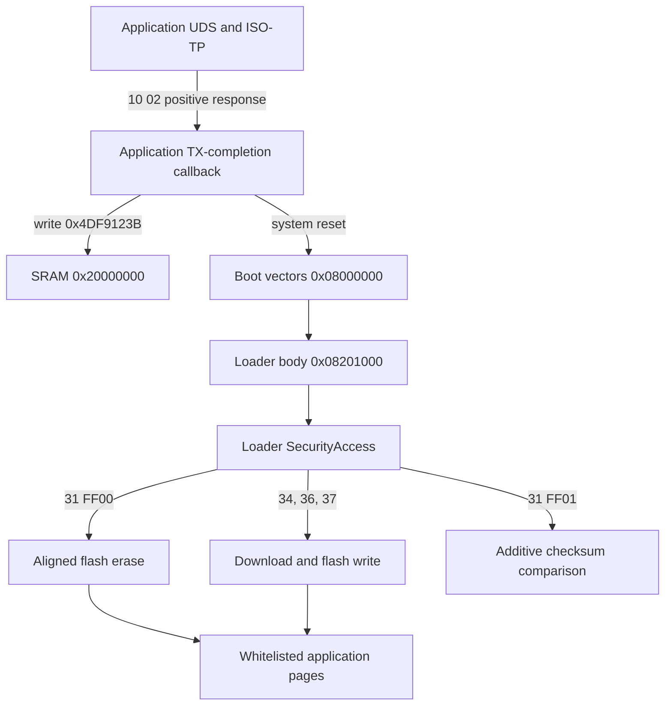

# M74.9 memory layout and bootloader contract

## Scope

The replaceable main firmware occupies the lower-flash application window. The
resident bootloader uses a split layout with vectors below the application and
executable code in high flash. Persistent ECU identity and learned data also
reside in high flash. An application update must use a strict address whitelist;
it must not treat a full flash image as a single replaceable region.

All ranges below use inclusive CPU addresses.

## Memory layout

| Address range | Contents | Update rule |
| --- | --- | --- |
| `0x08000000-0x08000FFF` | Bootloader vector page | Never erase or write during a main-firmware update. |
| `0x08001000-0x0805FFFF` | Main application, first software CRC segment | Replaceable application software. |
| `0x08060000-0x0807FFFB` | Calibration/data domain | Update separately from application software. |
| `0x0807FFFC-0x0807FFFF` | Calibration CRC word | Recompute after changing calibration/data. |
| `0x08080000-0x080FFFFB` | Main application, second software CRC segment | Replaceable application software; startup is at `0x08080000`. |
| `0x080FFFFC-0x080FFFFF` | Application CRC word | Recompute after changing application software. |
| `0x08100000-0x081FFFFF` | Reserved/erased flash | Preserve. |
| `0x08200000-0x08200FFF` | Boot validity and activation state | Bootloader-managed; exclude from application payloads. |
| `0x08201000-0x0822DFFB` | Bootloader code, configuration, and covered tail | Never erase or write during a main-firmware update. |
| `0x0822DFFC-0x0822DFFF` | Bootloader CRC word | Preserve with the bootloader. |
| `0x0822E000-0x0824DFFF` | Reserved/erased flash | Preserve. |
| `0x0824E000-0x0824EFFF` | Protected high-flash data | Preserve. |
| `0x0824F000-0x0824FFFF` | ECU identity data | Preserve. |
| `0x08250000-0x0825FFFF` | Emulated EEPROM backing store 0 | Preserve. |
| `0x08260000-0x0826FFFF` | Reserved/erased flash | Preserve. |
| `0x08270000-0x08273FFF` | Emulated EEPROM backing store 1 | Preserve. |
| `0x08274000-0x08274FFF` | High NVM | Preserve. |
| `0x08275000-0x083EFFFF` | Unclassified flash | Preserve. |

For an application-only writer, the sole permitted destination window is
`0x08001000-0x080FFFFF`. The calibration subrange and both CRC trailers still
require separate handling inside that window. Broad address acceptance by the
bootloader is not permission to overwrite its vectors, code, state, or NVM.

## Main firmware

The application software CRC covers two segments in this order:

```text
0x08001000-0x0805FFFF
0x08080000-0x080FFFFB
```

The little-endian CRC word is stored at `0x080FFFFC`. The application vector
table begins at `0x08001000`; its initial stack pointer is `0x20020000`, and its
reset vector points to Thumb code at `0x08080000`.

The calibration/data CRC covers `0x08060000-0x0807FFFB`, with its little-endian
CRC word at `0x0807FFFC`.

Both domains use CRC-32/MPEG-2:

| Parameter | Value |
| --- | --- |
| Polynomial | `0x04C11DB7` |
| Initial value | `0xFFFFFFFF` |
| Input reflection | None |
| Output reflection | None |
| Final XOR | `0x00000000` |

Erased bytes inside a CRC domain remain part of the CRC input and must retain
their intended value, normally `0xFF`.

## Bootloader

The bootloader is split across two flash areas:

```text
vector page:  0x08000000-0x08000FFF
loader body:  0x08201000-0x0822DFFB
loader CRC:   0x0822DFFC-0x0822DFFF
```

Its CRC input concatenates the vector page and loader body. The loader body
contains startup, CAN/ISO-TP transport, UDS programming services, security,
erase/write routines, checksum support, and flash/NVM geometry. Erased-looking
space through `0x0822DFFB` remains owned by the bootloader CRC domain.

The page at `0x08200000` holds boot validity and programming state. Its normal
marker is `0x43A0C212`; its programming marker is `0x2548A4D2`. Application
firmware must not manage this page as ordinary application data.

## Required application-to-bootloader contract

A replacement application must preserve these interfaces:

1. Place executable Thumb startup code at `0x08080000`.
2. Place a valid vector table at `0x08001000`, beginning with a suitable stack
   pointer and application reset vector.
3. Set Cortex-M VTOR to `0x08001000` early in startup, before relying on
   interrupts.
4. Implement UDS programming-session entry on physical diagnostic CAN IDs
   `0x7E0` request and `0x7E8` response at 500 kbit/s.
5. On an accepted `10 02` request, transmit the positive response before reset.
6. After that response completes, write programming token `0x4DF9123B` to
   `0x20000000` and issue a system reset.
7. Preserve token `0xF9C74A52` as the alternate/return boot intent if compatible
   timeout and recovery behavior is required.
8. Supply correct application and calibration CRC words at their fixed trailer
   addresses.

The bootloader does not require an application callback table. The fixed entry
address, vector relocation, SRAM token, and reset sequence form the interface.
An application can boot without the programming-session hook, but it then loses
the normal CAN route back into the resident loader.

## Distribution of the CAN flash-write chain



| Stage | Location | Responsibility |
| --- | --- | --- |
| Application transport and handoff | Lower application flash, with diagnostic code near `0x080Bxxxx` in the OEM layout | Accept programming session, send response, set SRAM token, reset |
| Reset handoff | SRAM `0x20000000` | Carry boot intent across reset |
| Hardware reset entry | `0x08000000-0x08000FFF` | Enter the resident loader |
| Loader UDS server | Approximately `0x08201000-0x08204FFF` | Session, security, erase/download/write/checksum request handling |
| Loader flash layer | Approximately `0x08205F30-0x08207FFF` | Physical erase and programming, completion callbacks |
| Loader configuration | Approximately `0x082093D8-0x08209AF7` | CAN setup, permitted flash geometry, memory and EEPROM layout |
| Activation state | `0x08200000-0x08200FFF` | Valid/programming state used during update and boot |

The running application does not program its own flash through UDS services
`0x34`, `0x36`, and `0x37`. It only performs the reset handoff. The resident
loader performs destructive operations while executing from high flash.

The loader-side programming sequence is:

1. Enter the loader through the application handoff.
2. Complete loader SecurityAccess.
3. Erase 4 KiB-aligned application ranges with RoutineControl `31 01 FF 00`.
4. Open a download with `34 00 44`, a four-byte destination address, and a
   four-byte length.
5. Send TransferData blocks with service `0x36`. The first block counter is
   zero, and each block carries at most 2,048 data bytes.
6. Close the transfer with `0x37` after the final physical write completes.
7. Verify content. Routine `31 01 FF 01` compares a caller-supplied 16-bit
   additive checksum over the selected address range.
8. Complete the boot validity transition before requesting application boot.

Transfer exit confirms that no write is busy. It does not prove that the
declared byte count arrived, validate the application/calibration CRCs, or
complete activation. The exact safe command sequence that restores the normal
validity marker is not part of the application programming contract yet. Keep
activation disabled until that sequence is implemented and validated.

## Writer requirements

- Enforce `0x08001000-0x080FFFFF` as the application-only write whitelist.
- Refuse any application update that overlaps the boot vector page, loader
  validity page, loader body, loader CRC, identity, EEPROM, high NVM, reserved,
  or unclassified regions.
- Treat application software and calibration as independent CRC domains.
- Use 4 KiB-aligned erase ranges and reconstruct every retained byte in an
  erased page.
- Require a complete payload for every declared download range.
- Read back or checksum every programmed range before activation.
- Do not report a successful update until CRC validation, validity-state
  finalization, reset, and application startup all succeed.
