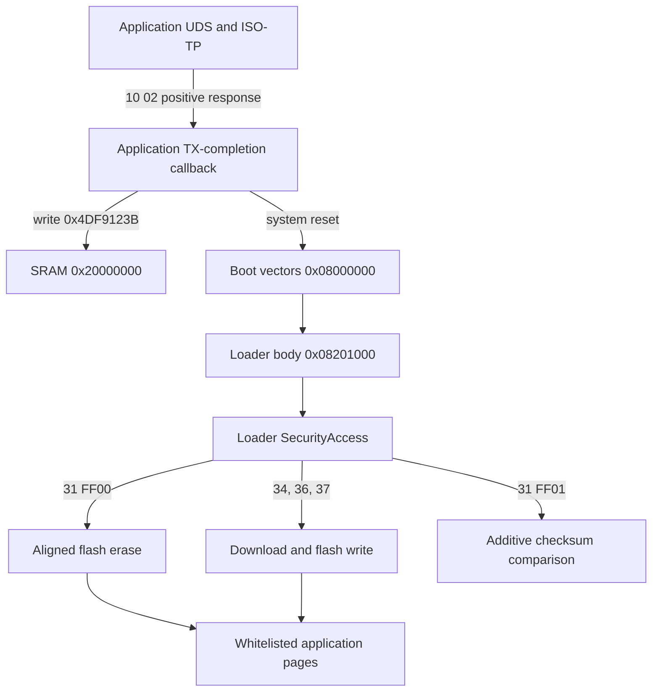

# M74.9 memory layout and bootloader contract

## Scope

The replaceable main firmware occupies the lower-flash application window. The
resident bootloader uses a split layout with vectors below the application and
executable code in high flash. Persistent ECU identity and learned data also
reside in high flash. An application update must use a strict address whitelist;
it must not treat a full flash image as a single replaceable region.

All ranges below use inclusive CPU addresses.

## Memory layout

| Address range | Contents | Update rule |
| --- | --- | --- |
| `0x08000000-0x08000FFF` | Bootloader vector page | Never erase or write during a main-firmware update. |
| `0x08001000-0x0805FFFF` | Main application, first software CRC segment | Replaceable application software. |
| `0x08060000-0x0807FFFB` | Calibration/data domain | Update separately from application software. |
| `0x0807FFFC-0x0807FFFF` | Calibration CRC word | Recompute after changing calibration/data. |
| `0x08080000-0x080FFFFB` | Main application, second software CRC segment | Replaceable application software; startup is at `0x08080000`. |
| `0x080FFFFC-0x080FFFFF` | Application CRC word | Recompute after changing application software. |
| `0x08100000-0x081FFFFF` | Reserved/erased flash | Preserve. |
| `0x08200000-0x08200FFF` | Boot validity and activation state | Bootloader-managed; exclude from application payloads. |
| `0x08201000-0x0822DFFB` | Bootloader code, configuration, and covered tail | Never erase or write during a main-firmware update. |
| `0x0822DFFC-0x0822DFFF` | Bootloader CRC word | Preserve with the bootloader. |
| `0x0822E000-0x0824DFFF` | Reserved/erased flash | Preserve. |
| `0x0824E000-0x0824EFFF` | Protected high-flash data | Preserve. |
| `0x0824F000-0x0824FFFF` | ECU identity data | Preserve. |
| `0x08250000-0x0825FFFF` | Emulated EEPROM backing store 0 | Preserve. |
| `0x08260000-0x0826FFFF` | Reserved/erased flash | Preserve. |
| `0x08270000-0x08273FFF` | Emulated EEPROM backing store 1 | Preserve. |
| `0x08274000-0x08274FFF` | High NVM | Preserve. |
| `0x08275000-0x083EFFFF` | Unclassified flash | Preserve. |

For an application-only writer, the sole permitted destination window is
`0x08001000-0x080FFFFF`. The calibration subrange and both CRC trailers still
require separate handling inside that window. Broad address acceptance by the
bootloader is not permission to overwrite its vectors, code, state, or NVM.

## Deployment artifacts and tools

**Current status:** the [Java CLI](cli-uploader.md) implements I865 OEM CAN
programming, verification and persistent application activation. Host tests and
native ARM emulation pass; real PCAN flashing and physical cold-boot validation
remain bench follow-ups. Direct MCU programming remains a separate bench route.

### Why there is no application `.bin`

A raw binary contains bytes without destination addresses. This application's
software occupies two separated ranges with calibration between them. Flattening
the software into one binary either fills that gap, risking calibration overwrite,
or removes the gap and places the second segment at the wrong address when written
as one contiguous block. A separate address manifest and a range-aware writer could
make split binaries usable, but this build does not implement that format.

Intel HEX and Motorola S-record files carry absolute addresses. Our `.hex` and
`.srec` software outputs omit the calibration range entirely while including all
bytes, including `0xFF` padding, inside the two software ranges. The writer must
also preserve the gap when erasing; an addressed file alone cannot make a tool's
mass-erase or whole-span erase operation safe.

Consequently, raw application BIN, generic DFU, and replacement bootloader targets
are disabled. Never use an old `rusefi.bin` from an earlier build, and never apply
the generic rusEFI `rusefi.bin` upload address `0x08000000` to this ECU: that address
belongs to the resident bootloader. The bundle excludes generic flash scripts and
updater launchers that do not implement this layout.

### Which artifact goes where

Build from the repository root:

```sh
bash compile_firmware.sh
```

| Artifact | Device destination, inclusive | Purpose |
| --- | --- | --- |
| `ext/rusefi/firmware/build/rusefi.hex` | `0x08001000-0x0805FFFF` **and** `0x08080000-0x080FFFFF` | Intel HEX application software, with the application CRC already included at `0x080FFFFC`. |
| `ext/rusefi/firmware/build/rusefi.srec` | The same two software ranges | Equivalent Motorola S-record payload. In bundles it is named `rusefi_update.srec`. Choose one format; do not program both. |
| Separately generated `calibration.hex` or `calibration.srec` | `0x08060000-0x0807FFFF` only | An intentional calibration update, including its CRC at `0x0807FFFC`. Preserve existing calibration during a software-only update. |
| `rusefi.elf`, `.map`, `.list` | No deployment destination | Link/debug artifacts. The ELF lacks the final CRC trailers; do not use debugger ELF auto-download as a substitute for the generated HEX/SREC payload. |
| Full or autoupdate `.zip` | No deployment destination | Distribution containers. Extract the addressed payload; use the documented I865 CLI; archive naming does not establish hardware validation. |

The absolute addresses are already in HEX/SREC records: apply **no relocation or
base-address offset**. `0x08080000` is the executable startup address, not the
base at which to upload the entire file. Decode address records into bytes before
UDS TransferData; do not send the HEX/SREC text itself as firmware data.

For an uploader with explicit address/length fields, the software operation consists
of these two separate erase/download ranges. Lengths include CRC/padding bytes:

| Domain | Start address | Byte count | 4 KiB pages |
| --- | --- | --- | --- |
| Software, first range | `0x08001000` | `0x0005F000` (389,120) | 95 |
| Software, second range, including CRC | `0x08080000` | `0x00080000` (524,288) | 128 |
| Calibration, only when explicitly updating it | `0x08060000` | `0x00020000` (131,072) | 32 |

Do not replace the first two rows with one erase/download spanning
`0x08001000-0x080FFFFF`: that would include the retained calibration pages.

To prepare calibration, supply every byte from `0x08060000-0x0807FFFB`, obtained
from a complete retained or deliberately modified calibration image. This input
is exactly 131,068 bytes, without the existing CRC word:

```sh
python3 bin/m749_image.py --calibration --format hex calibration.bin calibration.hex
# Alternatively, generate S-records from the same input:
python3 bin/m749_image.py --calibration --format srec calibration.bin calibration.srec
```

Here `calibration.bin` is a raw **input data domain**, not a whole application
binary. The tool appends the new little-endian CRC and assigns the output addresses.
It never substitutes blank calibration during a software build.

### Toolsets and their current limits

| Route/toolset | Input or interface | Current use |
| --- | --- | --- |
| `compile_firmware.sh` and Python 3 `bin/m749_image.py` | ELF for software; complete raw data for calibration | Offline image preparation and CRC/range checks. These tools do not communicate with an ECU. |
| M74.9 Java tab or `bin/m749-cli.sh` / `.bat`, PEAK PCAN driver and native libraries | Physical CAN `0x7E0/0x7E8`, 500 kbit/s | Tab: identification. CLI: validated HEX/SREC upload, verification and activation; see [CLI guide](cli-uploader.md). |
| OEM resident loader plus an M74.9-specific ISO-TP/UDS writer | Decoded software or calibration HEX/SREC ranges over CAN | Implemented I865-specific CLI and application activation, pending live bench validation. Generic rusEFI OpenBLT/BootCommander is not this OEM protocol. |
| Artery AT-Link probe with Artery ICP Programmer over SWD | `rusefi.hex`; `calibration.hex` only for a separate calibration operation | Vendor toolset for evaluating direct MCU programming on the bench. No validated M74.9 programming profile, ECU connector pinout, or automatic activation procedure is supplied by this repository. |

Artery provides the [AT-Link and ICP tools](https://www.arterychip.com/en/support/tools.jsp?index=4).
Its [ICP Programmer manual](https://www.arterychip.com/download/TOOL/UM_ICP_Programmer_EN.pdf)
documents device connection, file information, sector/block erase, download, and
verification. The [AT-Link Console manual](https://arterychip.com/download/TOOL/UM_AT-Link_Console_Programmer_EN.pdf)
also documents HEX input, verification, and downloading without automatic sector
erase. These vendor capabilities do not establish that a default programming
profile preserves this ECU's OEM memory layout.

For a bench SWD evaluation, the required procedure is:

1. Establish the ECU's actual SWD connections and confirm the MCU is
   AT32F435ZMT7. Retain readable originals of software, calibration, and protected
   regions before any erase. Do not unlock protection as part of this procedure.
2. Load `rusefi.hex` and inspect the addresses against the two software rows above.
   Configure explicit erasure of only those pages and disable further automatic
   erasure during programming. If the tool cannot express or confirm those two
   disjoint erase ranges, do not use that profile.
3. Disable automatic reset/run and any serial-number, user-system-data,
   protection, or boot-configuration writes. Do not request mass erase.
4. Program the HEX records at their embedded addresses. Leave calibration and
   all regions outside the software ranges untouched. A calibration change is
   its own operation using only the calibration row above.
5. Read back every programmed range and compare it byte-for-byte with the
   decoded payload, including padding and CRC trailers. Validate the software
   CRC over both segments and the retained or updated calibration CRC separately;
   a generic programmer CRC display is not a substitute for these exact domains.
6. Treat successful programming/verification as bench evidence only. It does not
   finalize OEM validity state or prove that the resident loader will boot the
   application. Do not manually write the validity marker to bypass the missing
   activation sequence. Use the documented CRC-gated application path and verify its status.

There is therefore no supported one-command production upload to document yet.
The CAN loader sequence below defines the work still required of that uploader.

## Main firmware

The application software CRC covers two segments in this order:

```text
0x08001000-0x0805FFFF
0x08080000-0x080FFFFB
```

The little-endian CRC word is stored at `0x080FFFFC`. The application vector
table begins at `0x08001000`; its initial stack pointer is `0x20020000`, and its
reset vector points to Thumb code at `0x08080000`.

The calibration/data CRC covers `0x08060000-0x0807FFFB`, with its little-endian
CRC word at `0x0807FFFC`.

Both domains use CRC-32/MPEG-2:

| Parameter | Value |
| --- | --- |
| Polynomial | `0x04C11DB7` |
| Initial value | `0xFFFFFFFF` |
| Input reflection | None |
| Output reflection | None |
| Final XOR | `0x00000000` |

Erased bytes inside a CRC domain remain part of the CRC input and must retain
their intended value, normally `0xFF`.

## Bootloader

The bootloader is split across two flash areas:

```text
vector page:  0x08000000-0x08000FFF
loader body:  0x08201000-0x0822DFFB
loader CRC:   0x0822DFFC-0x0822DFFF
```

Its CRC input concatenates the vector page and loader body. The loader body
contains startup, CAN/ISO-TP transport, UDS programming services, security,
erase/write routines, checksum support, and flash/NVM geometry. Erased-looking
space through `0x0822DFFB` remains owned by the bootloader CRC domain.

The page at `0x08200000` holds boot validity and programming state. Its normal
marker is `0x43A0C212`; its programming marker is `0x2548A4D2`. Application
firmware must not manage this page as ordinary application data.

## Required application-to-bootloader contract

A replacement application must preserve these interfaces:

1. Place executable Thumb startup code at `0x08080000`.
2. Place a valid vector table at `0x08001000`, beginning with a suitable stack
   pointer and application reset vector.
3. Set Cortex-M VTOR to `0x08001000` early in startup, before relying on
   interrupts.
4. Implement UDS programming-session entry on physical diagnostic CAN IDs
   `0x7E0` request and `0x7E8` response at 500 kbit/s.
5. On an accepted `10 02` request, transmit the positive response before reset.
6. After that response completes, write programming token `0x4DF9123B` to
   `0x20000000` and issue a system reset.
7. Preserve token `0xF9C74A52` as the alternate/return boot intent if compatible
   timeout and recovery behavior is required.
8. Supply correct application and calibration CRC words at their fixed trailer
   addresses.

The bootloader does not require an application callback table. The fixed entry
address, vector relocation, SRAM token, and reset sequence form the interface.
An application can boot without the programming-session hook, but it then loses
the normal CAN route back into the resident loader.

## Distribution of the CAN flash-write chain



| Stage | Location | Responsibility |
| --- | --- | --- |
| Application transport and handoff | Lower application flash, with diagnostic code near `0x080Bxxxx` in the OEM layout | Accept programming session, send response, set SRAM token, reset |
| Reset handoff | SRAM `0x20000000` | Carry boot intent across reset |
| Hardware reset entry | `0x08000000-0x08000FFF` | Enter the resident loader |
| Loader UDS server | Approximately `0x08201000-0x08204FFF` | Session, security, erase/download/write/checksum request handling |
| Loader flash layer | Approximately `0x08205F30-0x08207FFF` | Physical erase and programming, completion callbacks |
| Loader configuration | Approximately `0x082093D8-0x08209AF7` | CAN setup, permitted flash geometry, memory and EEPROM layout |
| Activation state | `0x08200000-0x08200FFF` | Valid/programming state used during update and boot |

The running application does not program its own flash through UDS services
`0x34`, `0x36`, and `0x37`. It only performs the reset handoff. The resident
loader performs destructive operations while executing from high flash.

The loader-side programming sequence is:

1. Enter the loader through the application handoff.
2. Complete loader SecurityAccess.
3. Erase 4 KiB-aligned application ranges with RoutineControl `31 01 FF 00`.
4. Open a download with `34 00 44`, a four-byte destination address, and a
   four-byte length.
5. Send TransferData blocks with service `0x36`. The first block counter is
   zero, and each block carries at most 2,048 data bytes.
6. Close the transfer with `0x37` after the final physical write completes.
7. Verify content. Routine `31 01 FF 01` compares a caller-supplied 16-bit
   additive checksum over the selected address range.
8. Complete the boot validity transition before requesting application boot.

Transfer exit confirms that no write is busy. It does not prove that the
declared byte count arrived, validate the application/calibration CRCs, or
complete activation. The [CLI activation sequence](cli-uploader.md) uses the
loader metadata handshake to arm the SRAM return token. The application checks
all CRC domains, restores the normal marker last and exposes status/CRC DIDs.
The CLI confirms those values after a second reset with the SRAM token cleared.
This has offline native coverage; electrical and power-cycle testing is pending.

## Writer requirements

- Enforce `0x08001000-0x080FFFFF` as the application-only write whitelist.
- Refuse any application update that overlaps the boot vector page, loader
  validity page, loader body, loader CRC, identity, EEPROM, high NVM, reserved,
  or unclassified regions.
- Treat application software and calibration as independent CRC domains.
- Use 4 KiB-aligned erase ranges and reconstruct every retained byte in an
  erased page.
- Require a complete payload for every declared download range.
- Read back or checksum every programmed range before activation.
- Do not report a successful update until CRC validation, validity-state
  finalization, reset, and application startup all succeed.

## Activation ABI

The application reserves 32 bytes at 0x0805FFE0 for `M749ACT1`, pinned I865 boot
CRC 0xD7B6B894 and protocol version 1. These bytes remain inside the software
CRC domain. DIDs F1A0-F1A3 return, respectively, ready status 0x4D740101,
software CRC, calibration CRC and the current persistent marker (big-endian).
The validity-page operation is confined to 0x08200000-0x08200FFF and publishes
0x43A0C212 only after CRC checks and restoration/verification of the page body.
Generic AT32 MFS remains disabled. Loader-managed metadata writes are described
in the [CLI guide](cli-uploader.md); they are never arbitrary payload ranges.
